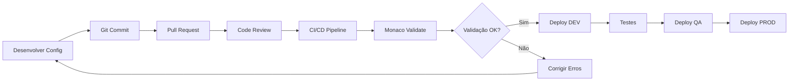

<div align="center">

# 🏎️ Monaco - Dynatrace Configuration as Code

### Gerencie configurações do Dynatrace como código | Versionamento | Automação | Consistência

**[🚀 Começar](#-instalação-no-windows)** · **[📖 Documentação](#-conceitos-fundamentais)** · **[💡 Exemplos](#-casos-de-uso)**

---

</div>

---

## 🎯 Visão Geral

**Monaco** é a ferramenta oficial da Dynatrace para **Configuration as Code (CaC)**, permitindo que você gerencie toda a configuração da sua plataforma de observabilidade através de arquivos versionáveis, elimine trabalho manual e garanta consistência entre ambientes.

### ✨ Destaques

<table>
<tr>
<td width="50%">

#### 🔧 **Infraestrutura como Código**
Trate configurações do Dynatrace da mesma forma que você trata seu código de aplicação - versionado, revisado e testado.

</td>
<td width="50%">

#### 🔄 **Automação Completa**
Integre com pipelines CI/CD para deploy automático de configurações em múltiplos ambientes.

</td>
</tr>
<tr>
<td width="50%">

#### 🎭 **Gestão Multi-Ambiente**
Um único conjunto de configurações gerencia DEV, QA, PROD com variações controladas.

</td>
<td width="50%">

#### 🛡️ **Governança & Auditoria**
Rastreabilidade completa de quem mudou o quê, quando e por quê através do Git.

</td>
</tr>
</table>

---

## 🆚 Comparativo: Manual vs Monaco

<table>
<thead>
<tr>
<th width="20%">Aspecto</th>
<th width="40%">❌ Abordagem Manual</th>
<th width="40%">✅ Com Monaco</th>
</tr>
</thead>
<tbody>
<tr>
<td><strong>Configuração</strong></td>
<td>Interface web, cliques repetitivos</td>
<td>Código YAML/JSON versionado</td>
</tr>
<tr>
<td><strong>Consistência</strong></td>
<td>Configurações divergem entre ambientes</td>
<td>Padrão garantido em DEV/QA/PROD</td>
</tr>
<tr>
<td><strong>Rastreabilidade</strong></td>
<td>Sem histórico, difícil auditoria</td>
<td>Git log completo + aprovações</td>
</tr>
<tr>
<td><strong>Erros</strong></td>
<td>Humanos, difíceis de detectar</td>
<td>Validação automática + revisão</td>
</tr>
<tr>
<td><strong>Rollback</strong></td>
<td>Recriação manual, demorado</td>
<td>Git revert + redeploy</td>
</tr>
<tr>
<td><strong>Escala</strong></td>
<td>Tempo cresce linearmente</td>
<td>Automação para N ambientes</td>
</tr>
<tr>
<td><strong>Colaboração</strong></td>
<td>Conhecimento isolado</td>
<td>Code review + documentação viva</td>
</tr>
</tbody>
</table>

---

## 🧱 Conceitos Fundamentais

### Arquitetura do Monaco

```
┌─────────────────────────────────────────────────────────────┐
│                     SEU REPOSITÓRIO GIT                      │
│  ┌────────────────────────────────────────────────────────┐ │
│  │  manifest.yaml           (ambientes e projetos)        │ │
│  │  environments.yaml       (configuração de ambientes)   │ │
│  │                                                         │ │
│  │  projects/                                              │ │
│  │    ├── dashboards/                                      │ │
│  │    │   ├── config.yaml                                  │ │
│  │    │   └── performance-dashboard.json                   │ │
│  │    ├── management-zones/                                │ │
│  │    │   └── config.yaml                                  │ │
│  │    └── alerting/                                        │ │
│  │        └── config.yaml                                  │ │
│  └────────────────────────────────────────────────────────┘ │
└──────────────────────┬──────────────────────────────────────┘
                       │
                       │  monaco deploy
                       ↓
          ┌────────────────────────┐
          │    MONACO CLI TOOL     │
          │  • Valida sintaxe      │
          │  • Resolve dependências│
          │  • Aplica configurações│
          └───────────┬────────────┘
                      │
        ┌─────────────┼─────────────┐
        │             │             │
        ↓             ↓             ↓
┌───────────┐  ┌───────────┐  ┌───────────┐
│   DEV     │  │    QA     │  │   PROD    │
│ Dynatrace │  │ Dynatrace │  │ Dynatrace │
│    API    │  │    API    │  │    API    │
└───────────┘  └───────────┘  └───────────┘
```

### 🎯 Fluxo de Trabalho



---

## 📦 Instalação no Windows

### Pré-requisitos

- Windows 10/11 ou Windows Server 2016+
- PowerShell 5.1+ ou PowerShell Core 7+
- Acesso à internet
- Token API do Dynatrace com permissões adequadas

---

### 🔧 Método 1: Instalação via Binário (Recomendado)

#### Passo 1: Download

1. Acesse a [página de releases do Monaco](https://github.com/dynatrace/dynatrace-configuration-as-code/releases)
2. Baixe a versão mais recente para Windows:
   - `monaco-windows-amd64.exe` (64-bit)
   - `monaco-windows-386.exe` (32-bit)

#### Passo 2: Preparar o ambiente

```powershell
# Criar diretório para o Monaco
New-Item -ItemType Directory -Path "C:\Tools\Monaco" -Force

# Mover o executável baixado
Move-Item "C:\Users\SeuUsuario\Downloads\monaco-windows-amd64.exe" "C:\Tools\Monaco\monaco.exe"
```

#### Passo 3: Adicionar ao PATH

**Opção A: Via PowerShell (Temporário)**
```powershell
$env:Path += ";C:\Tools\Monaco"
```

**Opção B: Via Variáveis de Ambiente (Permanente)**
```powershell
# Adicionar ao PATH do sistema
[Environment]::SetEnvironmentVariable(
    "Path",
    $env:Path + ";C:\Tools\Monaco",
    [EnvironmentVariableTarget]::Machine
)

# OU adicionar ao PATH do usuário
[Environment]::SetEnvironmentVariable(
    "Path",
    $env:Path + ";C:\Tools\Monaco",
    [EnvironmentVariableTarget]::User
)
```

**Opção C: Via Interface Gráfica**
1. Pressione `Win + Pause` ou abra `Painel de Controle > Sistema`
2. Clique em **Configurações avançadas do sistema**
3. Clique em **Variáveis de Ambiente**
4. Em **Variáveis do sistema**, selecione `Path` e clique em **Editar**
5. Clique em **Novo** e adicione: `C:\Tools\Monaco`
6. Clique em **OK** em todas as janelas

#### Passo 4: Verificar instalação

```powershell
# Abrir um NOVO terminal PowerShell e executar
monaco --version

# Saída esperada:
# monaco v2.x.x
```

---

### 🔧 Método 2: Instalação via Chocolatey

Se você usa o [Chocolatey](https://chocolatey.org/):

```powershell
# Instalar Chocolatey (se ainda não tiver)
Set-ExecutionPolicy Bypass -Scope Process -Force
[System.Net.ServicePointManager]::SecurityProtocol = [System.Net.ServicePointManager]::SecurityProtocol -bor 3072
iex ((New-Object System.Net.WebClient).DownloadString('https://community.chocolatey.org/install.ps1'))

# Instalar Monaco
choco install monaco-cli -y

# Verificar
monaco --version
```

---

### 🔧 Método 3: Instalação via Scoop

Se você usa o [Scoop](https://scoop.sh/):

```powershell
# Instalar Scoop (se ainda não tiver)
irm get.scoop.sh | iex

# Adicionar bucket extras
scoop bucket add extras

# Instalar Monaco
scoop install monaco

# Verificar
monaco --version
```

---

### 🔐 Configuração de Credenciais

#### Criar Token API no Dynatrace

1. Acesse seu tenant Dynatrace
2. Vá em **Settings > Integration > Dynatrace API**
3. Clique em **Generate token**
4. Nomeie o token (ex: "Monaco CLI")
5. Selecione as permissões necessárias:
   - `ReadConfig`
   - `WriteConfig`
   - `DataExport` (opcional, para backup)
   - `settings.read` e `settings.write` (para Settings 2.0)
6. Copie e salve o token gerado

#### Configurar Variáveis de Ambiente

**Método Seguro (Recomendado)**
```powershell
# Definir variáveis para a sessão atual
$env:DT_ENVIRONMENT = "https://seu-tenant.dynatrace.com"
$env:DT_API_TOKEN = "dt0c01.XXXXXXXXXXXXXXXX"

# Ou adicionar ao perfil do PowerShell permanentemente
# Edite: notepad $PROFILE
Add-Content $PROFILE @"
`$env:DT_ENVIRONMENT = 'https://seu-tenant.dynatrace.com'
`$env:DT_API_TOKEN = 'dt0c01.XXXXXXXXXXXXXXXX'
"@
```

**Alternativa: Arquivo de Environment**
```yaml
# environments.yaml
environments:
  - name: dev
    url:
      type: environment
      value: https://dev.dynatrace.com
    auth:
      token:
        type: environment
        name: DT_API_TOKEN_DEV

  - name: prod
    url:
      type: environment
      value: https://prod.dynatrace.com
    auth:
      token:
        type: environment
        name: DT_API_TOKEN_PROD
```

---

### ✅ Validação da Instalação

Execute este teste rápido:

```powershell
# Criar estrutura de teste
New-Item -ItemType Directory -Path ".\monaco-test\projects\test" -Force

# Criar manifest.yaml
@"
manifestVersion: "1.0"
projects:
  - name: test
"@ | Out-File -FilePath ".\monaco-test\manifest.yaml" -Encoding UTF8

# Criar environments.yaml
@"
environments:
  dev:
    - name: dev
      url:
        value: "$env:DT_ENVIRONMENT"
      auth:
        token:
          name: DT_API_TOKEN
"@ | Out-File -FilePath ".\monaco-test\environments.yaml" -Encoding UTF8

# Validar configuração
cd monaco-test
monaco validate
```

**Saída esperada:**
```
✓ Validation successful
  No errors found
```

---

## 🎯 Casos de Uso

<table>
<tr>
<td width="33%">

### 📊 Dashboards Padronizados
Deploy automático de dashboards corporativos em todos os ambientes

</td>
<td width="33%">

### 🚨 Alerting Consistente
Mesmas regras de alerta em DEV/QA/PROD com thresholds ajustáveis

</td>
<td width="33%">

### 🏷️ Auto-tagging Uniforme
Tags e Management Zones sincronizadas automaticamente

</td>
</tr>
<tr>
<td width="33%">

### 📈 SLOs como Código
Service Level Objectives versionados e auditáveis

</td>
<td width="33%">

### 🔍 Custom Services
Definições de serviços customizados replicáveis

</td>
<td width="33%">

### 📐 Anomaly Detection
Configurações de detecção de anomalias padronizadas

</td>
</tr>
</table>

---

## 🚀 Primeiros Passos

### Estrutura de Projeto Básica

```
meu-projeto-monaco/
│
├── manifest.yaml           # Define projetos e ambientes
├── environments.yaml       # Configuração de ambientes
│
├── projects/
│   ├── infrastructure/
│   │   ├── management-zones/
│   │   │   └── config.yaml
│   │   ├── auto-tags/
│   │   │   └── config.yaml
│   │   └── alerting-profiles/
│   │       └── config.yaml
│   │
│   ├── applications/
│   │   ├── dashboards/
│   │   │   ├── config.yaml
│   │   │   └── app-performance.json
│   │   └── slos/
│   │       └── config.yaml
│   │
│   └── monitoring/
│       ├── synthetic-monitors/
│       │   └── config.yaml
│       └── calculated-metrics/
│           └── config.yaml
│
└── README.md
```

### Comandos Essenciais

```powershell
# Validar todas as configurações
monaco validate

# Deploy em ambiente específico
monaco deploy --environment dev

# Deploy de um projeto específico
monaco deploy --project infrastructure --environment prod

# Modo dry-run (simular sem aplicar)
monaco deploy --dry-run --environment dev

# Download de configurações existentes
monaco download --environment dev
```

---

## 📚 Recursos Adicionais

<div align="center">

| Recurso | Link |
|---------|------|
| 📖 Documentação Oficial | [docs.dynatrace.com/monaco](https://docs.dynatrace.com) |
| 💻 Repositório GitHub | [github.com/dynatrace/dynatrace-configuration-as-code](https://github.com/dynatrace/dynatrace-configuration-as-code) |
| 💬 Community | [Dynatrace Community](https://community.dynatrace.com) |
| 🎓 Tutoriais | [Dynatrace University](https://university.dynatrace.com) |
| 🐛 Reportar Issues | [GitHub Issues](https://github.com/dynatrace/dynatrace-configuration-as-code/issues) |

</div>

---

## 🤝 Contribuindo

Encontrou algum erro nesta documentação ou quer adicionar conteúdo? Contribuições são bem-vindas!

1. Faça um fork do repositório
2. Crie uma branch para sua feature (`git checkout -b feature/melhorias`)
3. Commit suas mudanças (`git commit -m 'Adiciona melhorias na seção X'`)
4. Push para a branch (`git push origin feature/melhorias`)
5. Abra um Pull Request

---

## 📝 Licença

Este guia é distribuído sob a licença MIT. Monaco é uma ferramenta open-source mantida pela Dynatrace sob licença Apache 2.0.

---

<div align="center">

**Feito com ❤️ para a comunidade Dynatrace**

[⬆ Voltar ao topo](#-monaco---dynatrace-configuration-as-code)

</div>